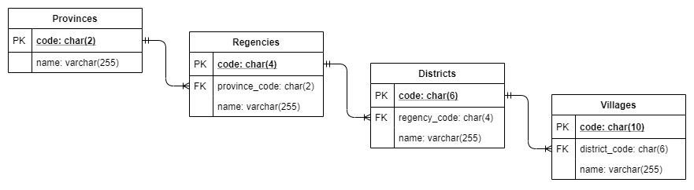

<h1 align="">IDN Area API</h1>

<p>
  
  
  
  
  
</p>

IDN Area API provides information on the **administrative areas of Indonesia**, from the provincial, district/city, sub-district, to village levels.

## Framework and Database

This API is built with [NestJS framework](https://nestjs.com) and writen in TypeScript. This API uses a relational database built on the following entity relationship diagram :



## API Endpoint

[sortby-query]: #sortby
[sortorder-query]: #sortorder

### Documentation

```
GET /docs
```

- Use this endpoint to get generated **API documentation**.

### 1. Get All Provinces

```
GET /provinces
```

- Use this endpoint to **get all of provinces**.
- This endpoint will return an array of province.
- Usage example: http://localhost:3000/provinces

**Filter Provinces by `name`**

```
GET /provinces?name={provinceName}
```

- Add `name` query to **filter the provinces by its name**.
- For example, if you replace the `{provinceName}` with "jawa" then you will get all the provinces whose names contain the word "jawa".
- The `{provinceName}` must be **at least 3 characters**. If not, you will get `400 Bad Request` response.
- The response will be an **empty array** `[]` if there are no province matched with the `{provinceName}`.
- Usage example: http://localhost:3000/provinces?name=jawa

> This endpoint also support [`sortBy`][sortby-query] and [`sortOrder`][sortorder-query] queries.

### 2. Get Specific Province

```
GET /provinces/{provinceCode}
```

- Use this endpoint to **get a specific province**.
- The `{provinceCode}` must be **2 numeric characters**. If not, you will get `400 Bad Request` response.
- This endpoint **will return** the province with the same code as `{provinceCode}`. Otherwise, you will get a `404 Not Found` response.
- Usage example: http://localhost:3000/provinces/32

### 3. Get All Regencies in a Province

```
GET /provinces/{provinceCode}/regencies
```

- Use this endpoint to **get all regencies in a province**.
- The `{provinceCode}` must be **2 numeric characters**. If not, you will get `400 Bad Request` response.
- This endpoint **will return** the array of regency if the `{provinceCode}` is exists. Otherwise, you will get a `404 Not Found` response.
- Usage example: http://localhost:3000/provinces/32/regencies

> This endpoint also support [`sortBy`][sortby-query] and [`sortOrder`][sortorder-query] queries.

### 4. Get Regencies by Name

```
GET /regencies?name={regencyName}
```

- Use this endpoint to **get the regencies by its name**.
- The `{regencyName}` **is required** and must be **at least 3 characters**. If not, you will get `400 Bad Request` response.
- This endpoint **will return** an array of regency.
- Usage example: http://localhost:3000/regencies?name=bandung

> This endpoint also support [`sortBy`][sortby-query] and [`sortOrder`][sortorder-query] queries.

### 5. Get Specific Regency

```
GET /regencies/{regencyCode}
```

- Use this endpoint to **get a specific regency**.
- The `{regencyCode}` must be **4 numeric characters**. If not, you will get `400 Bad Request` response.
- This endpoint **will return** the regency with the same code as `{regencyCode}`. Otherwise, you will get a `404 Not Found` response.
- Usage example: http://localhost:3000/regencies/3273

### 6. Get All Districts in a Regency

```
GET /regencies/{regencyCode}/districts
```

- Use this endpoint to **get all districts in a regency**.
- The `{regencyCode}` must be **4 numeric characters**. If not, you will get `400 Bad Request` response.
- This endpoint **will return** the array of district if the `{regencyCode}` is exists. Otherwise, you will get a `404 Not Found` response.
- Usage example: http://localhost:3000/regencies/3273/districts

> This endpoint also support [`sortBy`][sortby-query] and [`sortOrder`][sortorder-query] queries.

### 7. Get Districts by Name

```
GET /districts?name={districtName}
```

- Use this endpoint to **get the districts by its name**.
- The `{districtName}` **is required** and must be **at least 3 characters**. If not, you will get `400 Bad Request` response.
- This endpoint **will return** an array of district, or an **empty array** `[]` if there are no district matched with the `{districtName}`.
- Usage example: http://localhost:3000/districts?name=regol

> This endpoint also support [`sortBy`][sortby-query] and [`sortOrder`][sortorder-query] queries.

### 8. Get Specific District

```
GET /districts/{districtCode}
```

- Use this endpoint to **get a specific district**.
- The `{districtCode}` must be **6 numeric characters**. If not, you will get `400 Bad Request` response.
- This endpoint **will return** the district with the same code as `{districtCode}`. Otherwise, you will get a `404 Not Found` response.
- Usage example: http://localhost:3000/districts/327311

### 9. Get All Villages in a District

```
GET /districts/{districtCode}/villages
```

- Use this endpoint to **get all villages in a district**.
- The `{districtCode}` must be **6 numeric characters**. If not, you will get `400 Bad Request` response.
- This endpoint **will return** the array of village if the `{districtCode}` is exists. Otherwise, you will get a `404 Not Found` response.
- Usage example: http://localhost:3000/districts/327311/villages

> This endpoint also support [`sortBy`][sortby-query] and [`sortOrder`][sortorder-query] queries.

### 10. Get Villages by Name

```
GET /villages?name={villageName}
```

- Use this endpoint to **get the villages by its name**.
- The `{villageName}` **is required** and must be **at least 3 characters**. If not, you will get `400 Bad Request` response.
- This endpoint **will return** an array of village, or an **empty array** `[]` if there are no village matched with the `{villageName}`.
- Usage example: http://localhost:3000/villages?name=balong

> This endpoint also support [`sortBy`][sortby-query] and [`sortOrder`][sortorder-query] queries.

### 11. Get Specific Village

```
GET /villages/{villageCode}
```

- Use this endpoint to **get a specific village**.
- The `{villageCode}` must be **10 numeric characters**. If not, you will get `400 Bad Request` response.
- This endpoint **will return** the village with the same code as `{villageCode}`. Otherwise, you will get a `404 Not Found` response.
- Usage example: http://localhost:3000/villages/3273111004

## Query Parameters

You can use query parameters to control what data is returned in endpoint responses.

### `sortBy`

```
GET /...?sortBy={code|name}
```

- Add `sortBy` query to **sorting the result** by `code` or `name`.
- The `sortBy` **can only be filled** by `code` or `name`. If not, you will get `400 Bad Request` response.
- If `sortBy` **is not set**, sorting will be done by the `code`.
- Usage example :
  - At [`provinces`](#1-get-all-provinces) endpoint: http://localhost:3000/provinces?sortBy=name
  - At [`regencies`](#4-get-regencies-by-name) endpoint: http://localhost:3000/regencies?name=bandung&sortBy=code

### `sortOrder`

```
GET /...?sortOrder={asc|desc}
```

- Add `sortOrder` query to **specify the sort order** whether ascending `asc` or descending `desc`.
- The `sortOrder` **can only be filled** by `asc` or `desc`. If not, you will get `400 Bad Request` response.
- If `sortOrder` **is not set**, sorting will be done in `asc` order.
- Usage example :
  - At [`districts`](#7-get-districts-by-name) endpoint: http://localhost:3000/districts?name=regol&sortOrder=desc
  - At [`villages`](#10-get-villages-by-name) endpoint: http://localhost:3000/villages?name=balong&sortOrder=asc

> These queries can be combined with other queries linked by `&` character.
>
> For example : http://localhost:3000/provinces?name=jawa&sortBy=name&sortOrder=asc

## Environment Settings

**1. Create `.env` file**

You can easily duplicate the `.env.example` file and rename it to `.env`.

**2. Configure `HOST` and `PORT`**

Open `.env` file, then :

- Set `HOST` with the hostname of your app. The default is `localhost`.
- Set `PORT` with port number you want to use. The default is `3000`.

The default values of `HOST` and `PORT` is example values to used in **development** stage. You may have to **change it** later for production stage.

**3. Configure the database connection**

**4. App is ready**

Now you are ready to run the app.

## Running The App

For run the app in development environment, use this command :

```bash
$ npm run start
```

See [nestjs.md](nestjs.md) for details.

## Live Demo

You can try the API by replacing the http://localhost:3000 with http://13.213.49.93.
